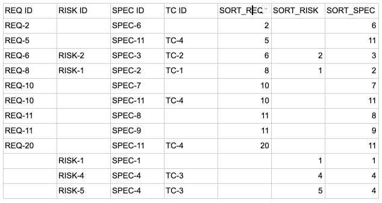
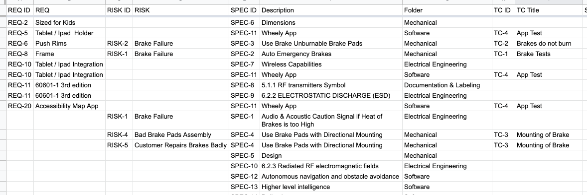

# Custom Reports in Google Sheets

While the reporting functionality of Matrix provides a lot of different ways to export data to spreadsheets, in some cases more complex reporting structures have to be used to give a complete overview. With Google Sheets it is possible to automate the creation of spreadsheets to perform complex transformations and formatting in an automated fashion.
Matrix provides a set of functions in Google’s Apps Script language that you can use in your spreadsheets to generate the type of report that you require.

## Step by step instructions

Follow the following steps to run the scripts to generate your own reports. This tutorial is based on the Excel export functionality of Matrix which generates an Excel sheet with all the layers and links between them. The names of the categories will be different depending on the project setup but the general workflow is the same.

### Export the data from Matrix

Find the Project Export to Excel report in the Matrix project, then run it to generate the spreadsheet with the desired data. Make sure that you only select the parts of the project that you actually want to include in your report.

### Create a new Google Sheet

Go to Google Sheets and create a blank spreadsheet. When the spreadsheet opens select File -> Import and in the import dialog select Upload and then drag in the Excel report you created. When the Import file dialog comes up select the Insert new sheet(s) option and press Import data.
You should now have all the tabs from the Excel export, with one tab per category and an empty tab called Sheet1 from the original file. Delete this empty Sheet1.

### Set up the scripts

In the menu, click on Tools -> Script Editor. The Editor should open in a new tab. Once open, click on File -> New -> Script File and enter Matrix as the new file name. Once Matrix.gs opens in a new tab, replace the text with the MatrixRequirements.gs script from GitHub. Press Save and give the project a name, for example Report Script.
Go back to the original script by clicking on Code.gs, and replace the content with the Example.gs script from GitHub.

### Configuring the script
The script performs multiple steps that you can tweak to adjust your output:
This is the entry point and can be run from the menu by selecting it in the dropdown, then pressing on the run button

    function runGenerator() {

The output configuration determines which columns will appear in the final spreadsheet. Each column is on a single line with a title, the number of the input column and the type of processing.
The input column index is determined by the order of the input data. For example if you start at SPEC -> TC -> XTC and then add uplinks for REQ and RISK then the order will be SPEC, TC, XTC, REQ, RISK, starting at an index of 0.

    var output = {
      columns: [
        { title: "REQ ID", inputCol: 3, processing: "id"},
        { title: "RISK ID", inputCol: 4, processing: "id"},
        { title: "SPEC ID", inputCol: 0, processing: "id"},
        { title: "TC ID", inputCol: 1, processing: "id"},
      ],

Sort is applied on the final table in the order specified here using numerical sorting

      sortBy: ["REQ","RISK","SPEC"],

Specifies which rows and columns to freeze for scrolling

      freeze: {
        rows: 1,
        columns: 0,
      }
    };

    var s = SpreadsheetApp.getActiveSpreadsheet();

Read in the data from the existing tabs in the spreadsheet. This looks for tabs with these names

    var allData = dumpAllData(["XTC","TC","SPEC","RISK","REQ"]);

Create a flat data structure based on the data set, starting at the provided category and following the downlinks to the end

    var flat = followDownlinks(allData, "SPEC");

Add additional data based on the uplinks. The first parameter is the start of the uplink, the second the target. Make sure you do this in order, here it first adds the links from SRS to SR, then from SR to CR.

    flat = addRows(flat, allData, "SPEC", "REQ");
    flat = addRows(flat, allData, "SPEC", "RISK");

At this point all the data is prepared and you provide it the output definition (columns) to generate the final spreadsheet.

      var expanded = expandData(allData, flat, output);

Remove duplicate rows which can occur if some categories are loaded but not included in the final sheet

      expanded.data = removeDuplicates(expanded.data);

Now create a new sheet or look for an existing one to update based on the sheet (tab) name

      var sheetName = "MY_REPORT";
      var newSheet = s.getSheetByName(sheetName);
      if (newSheet) {
        newSheet.clear({formatOnly:false, contentsOnly:true});
      } else {
        newSheet = s.insertSheet();
        newSheet.setName(sheetName);
      }      

Write the headers to the sheet. The header text is included in the output from expandData

      newSheet.getRange(1,1,1,expanded.headers.length).setValues([expanded.headers]);
      newSheet.setFrozenRows(output.freeze.rows);
      newSheet.setFrozenColumns(output.freeze.columns);    

Write the data to the spreadsheet, then sort the data. The sorting information is also created by the expandData function

      var fullRange = newSheet.getRange(2,1,expanded.data.length,expanded.data[0].length);
      fullRange.setValues(expanded.data);
      fullRange.sort(expanded.sortInfo);
    }

### Reviewing and adjusting the results

The result of this should look something like this:

This is the raw output of expandData function. It starts at the SPEC entries and then creates a row for each combination of down and up-links. This is why, for example, SPEC-11 appears 3 times, once for each REQ it is linked from.
The 3 columns at the end are repetitions of the original IDs, stripped of their numerical part, to allow for easy sorting of the table by these IDs.

What is missing now is to add textual data from the actual items. This can be done by adding new rows to the output definition at the top. There are four types of cell that can be generated:

* id: This is the straight ID of the item, for example SPEC-11
* number: This is the numerical value of the ID, in the case of SPEC-11 this would be 11
* blank: This will leave the column empty, for manual data entry later on
* "Column title": The column header of one of the source tables. This will pull in the value at that column. For example “Title” would pull in the title value of SPEC-11 instead of the ID.

A configuration could be:

    var output = {
      columns: [
        { title: "REQ ID", inputCol: 3, processing: "id"},
        { title: "REQ", inputCol: 3, processing: "Title"},
        { title: "RISK ID", inputCol: 4, processing: "id"},
        { title: "RISK", inputCol: 4, processing: "Title"},
        { title: "SPEC ID", inputCol: 0, processing: "id"},
        { title: "Description", inputCol: 0, processing: "Title"},
        { title: "Folder", inputCol: 0, processing: "Folder"},
        { title: "TC ID", inputCol: 1, processing: "id"},
        { title: "TC Title", inputCol: 1, processing: "Title"},
      ],
      sortBy: ["REQ","RISK","SPEC"],
      freeze: {
        rows: 1,
        columns: 0,
      }
    };

Which would result in:

